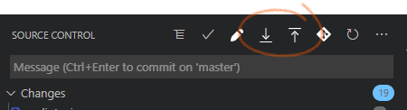

# VSCode Git Commit (BETA)

VSCode git commit is a VSCode extension to create nice commit message with emoji and prefix.

> This is a beta version, more features are coming

## How to use ?

Icons to pull and push are added in scm view when using git 

The two actions are available with following commands:

- pull `ctrl+alt+down` (`cmd+shift+down` on Mac)
- push `ctrl+alt+up` (`cmd+shift+up` on Mac)

## Changelog

**0.0.1** (*08-18-2020*): 
Initial release 

## Credits

Icons made by <a href="https://www.flaticon.com/free-icon/upload_158744" title="Gregor Cresnar">Gregor Cresnar</a> from <a href="https://www.flaticon.com/" title="Flaticon">www.flaticon.com</a>

## The end

If you find english error, please create an issue, I'm a french guys !

**Have a nice day and be happy !**

